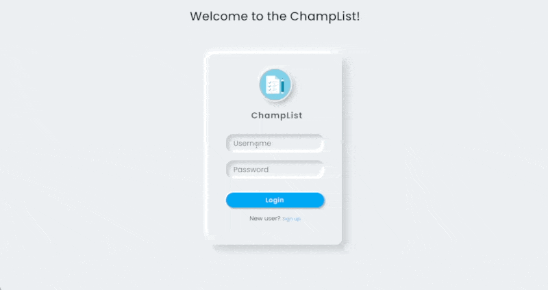
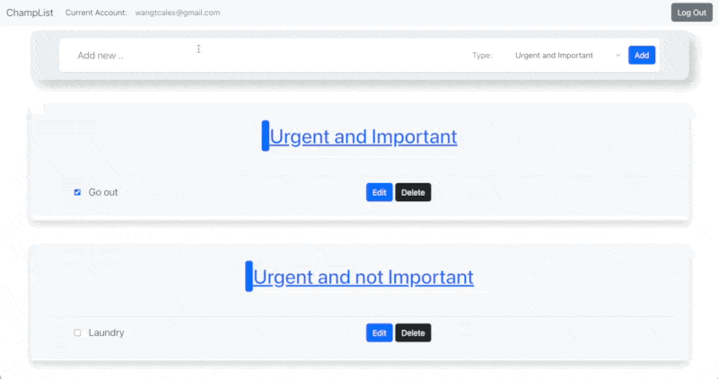
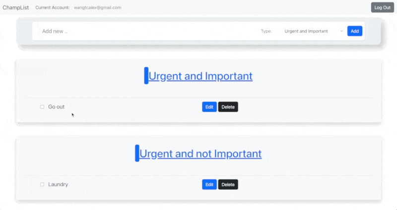
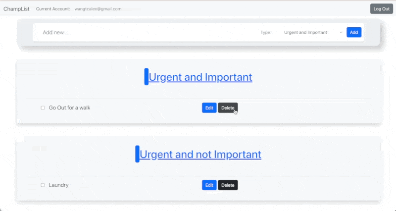
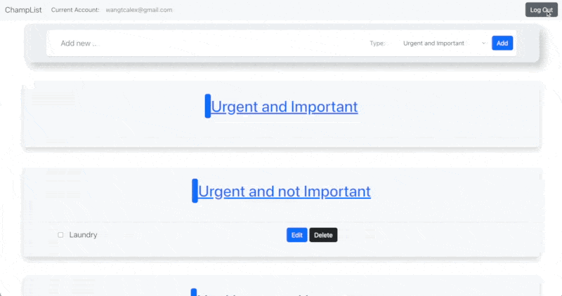

# "Champions’ List": a todo list makes you success

Created by Tianchang Wang & Guoqin Sun

Course Link: https://johnguerra.co/classes/webDevelopment_fall_2022/

Video Presentaton Link: https://www.youtube.com/watch?v=EeHddwvjDws

Slides Link: https://docs.google.com/presentation/d/1pyadkUvMDRdbhuW4VdrL9WlxBsn0V5m09Vo6PMc_RUo/edit?usp=sharing

The design document is avaialble at [here](./design-document.md).

## Project Objective

- We’ll build a novel and creative todo list app that implements the [Eisenhower’s Urgent/Important Principle.](https://www.mindtools.com/pages/article/newHTE_91.htm#:~:text=The%20urgent%20are%20not%20important,effective%20as%20well%20as%20efficient.)
- It divides all todo items to 4 categories: urgent and important, important but not urgent, urgent but not important, not urgent and not important
- Traditional todo lists don’t emphasize the “important but not urgent” items, causing users either forget these items or add all of them together and feel overwhelmed. Our todo list will avoid such problems.
- Allow users to add optional comment to each item, helping users to specify their needs with more comprehensive description.

## Screenshot 

**Login**

**Create Item**

**Edit Item Title**

**Delete Item**

**Logout**

## Pre-requiste

We've prepared a online demo at: http://134.209.68.221:5000

To run this project locally, you'll need

- MongoDB
- Node & NPM
- Git

## Instructions on Build

1. Clone this project to your local directory: `git clone https://github.com/chang2000/cs5610-p2-champlist`
2. `cd` to the project directory, run `npm install` to install dependencies.
3. Use `npm start` to start the app, and the app is running on  `http://localhost:5000`.
4. You may also use `npm run dev` to enter development mode, any changes of code will be reflected to app immediately. 