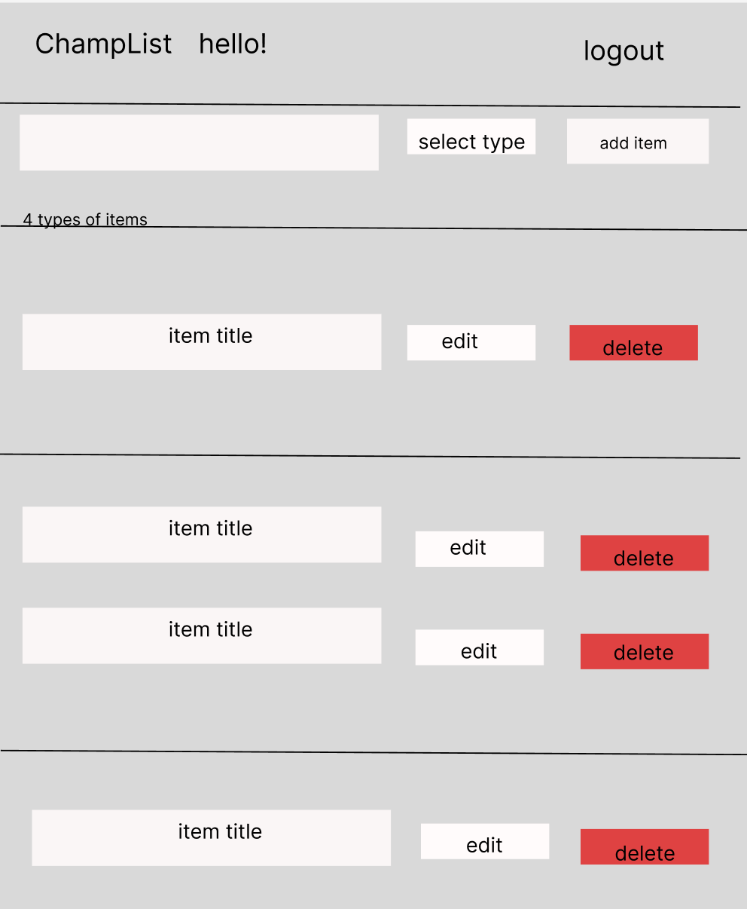

# Design Document of Champion's List

## Objective:

- We build a novel and creative todo list app that implements the [Eisenhower’s Urgent/Important Principle](https://www.mindtools.com/pages/article/newHTE_91.htm#:~:text=The%20urgent%20are%20not%20important,effective%20as%20well%20as%20efficient.).
- It divides all todo items to 4 categories: urgent and important, important but not urgent, urgent but not important, not urgent and not important
- Traditional todo lists don’t emphasize the “important but not urgent” items, causing users either forget these items or add all of them together and feel overwhelmed. Our todo list will avoid such problems.
- Allow users to add optional comment to each item, helping users to specify their needs with more comprehensive description.

## Functionalities and work division:

- Register and login. [@Guoqin Sun](https://web-dev-neu.slack.com/team/U0427QLFHUK)
- Basic Page Layout [@Guoqin Sun](https://web-dev-neu.slack.com/team/U0427QLFHUK)
- Create a todo on the paper. [@Tianchang Wang](https://web-dev-neu.slack.com/team/U042ABD4K4L)
- Add an optional comment to each item. [@Guoqin Sun](https://web-dev-neu.slack.com/team/U0427QLFHUK)
- Mark item as done, delete item, edit item. [@Tianchang Wang](https://web-dev-neu.slack.com/team/U042ABD4K4L)
- Deployment and Framework. [@Tianchang Wang](https://web-dev-neu.slack.com/team/U042ABD4K4L)

## User stories:

- Alice is an international student who just entered Northeastern University, which is exciting but also challenging for her. She needs so many things to take care of: getting a driver license, submitting assignments, practicing leetcode, applying for internships and going to Costco for groceries. She also wants to learn guitar and perform it at next year’s orientation. She finds it hard to prioritize all these tasks. Champion’s Todo List can help her categorize different things in her life, she can focus on finishing the urgent and important things first, spare time for other things. Our app reminds her the important but not urgent things are to ensure her long-term success.

- Bob is trying to find an easy-to-use todo list to make his life more efficient. However, after reviewing todo list apps on the market, he finds they are hard to use with tons of unnecessary features. He messed up putting all todo items into various categories. Our app helps him easily divide all todo items into proper categories and can be found easily.

## Mock Up

